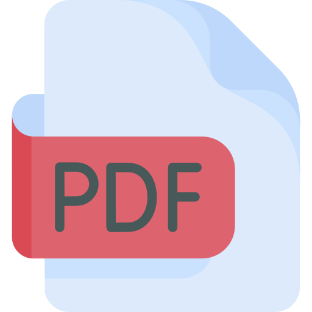

<div align="center">
    <div style="width:870px;height:300px;display:flex;margin:auto">
        &emsp;&emsp;&emsp;
        <span style="line-height:300px;font-size:80px">pdf-from-html</span>
    </div>
</div>

> pdf-from-html is a nodejs library to transform an html (possibly from [markdown-it](https://markdown-it.github.io/)) in a PDF.

<div align="center">
    <div>
        <a
            href="https://travis-ci.org/HQ20/pdf-from-html"></a>&emsp;
        <a
            href="https://dependabot.com"></a>&emsp;
    </div>
</div>


## Installation

Install it with npm or yarn.

```bash
$ npm install --dev pdf-from-html
# or
$ yarn add --dev pdf-from-html
```

## Usage

It's possible to use it from command line

```bash
$ pdf-from-html docs/ somefile.html
```
as npm script
```bash
"scripts": {
    "pdf": "pdf-from-html docs/ somefile.html"
},
```
or as part of your nodejs app
```typescript
import { generatePDF } from 'pdf-from-html';
// or
// const generatePDF = require('pdf-from-html').generatePDF;
// and then just call the method
generatePDF(outputDir: string, outputFileName: string, inputContent: string);
```

## Contributing
Pull requests are welcome. For major changes, please open an issue first to discuss what you would like to change.

Please make sure to update tests as appropriate.

## License
[Apache-2.0](LICENSE.md)

## Credits
* Icons made by <a href="https://www.flaticon.com/authors/freepik" title="Freepik">Freepik</a> from <a href="https://www.flaticon.com/" title="Flaticon"> www.flaticon.com</a>